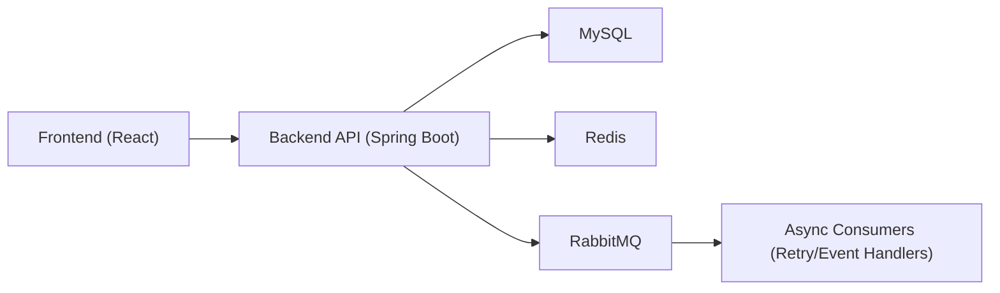

# Architecture Overview | 架构说明

## 1. Current Runtime (Modular Monolith)
- Frontend: React + TypeScript + Ant Design
- Backend: Spring Boot + MyBatis
- Data: MySQL + Redis + RabbitMQ
- Auth: JWT + RBAC + property-level data scope

## 2. Core Layers
- `controller`: API entry and permission guard
- `service`: business orchestration and state transition
- `mapper`: SQL and persistence access
- `domain/entity|dto|vo`: model contracts
- `config`: security, data-scope interception, mq config
- `common`: constants, exceptions, response wrappers

## 3. Domain Modules
- Auth & System governance
- Asset management (property/room type/room/status)
- Order & stay lifecycle
- Pricing & inventory
- OTA integration skeleton (callback/idempotency/retry)
- CRM & membership
- Finance & operations
- Logs and audit

## 4. High-Level Flow

## 5. Data Isolation Strategy
- `currentProperty` is the first scope boundary.
- SQL placeholders are injected by MyBatis interceptor:
  - `/*DS_GROUP:group_id*/ 1=1`
  - `/*DS_BRAND:brand_id*/ 1=1`
  - `/*DS_PROPERTY:property_id*/ 1=1`
- If no allowed ids are present, fallback to `1=0` deny behavior.

## 6. OTA Callback Safety Baseline
- Idempotency key:
  - `channel + eventType + externalRequestNo` (fallback payload digest)
- Duplicate-consume protection:
  - Redis `SETNX` + DB unique key
- Retry skeleton:
  - `ota_callback_retry_task` + RabbitMQ retry/dead-letter extension point

## 7. Evolution Path to Microservices
- Extract bounded services gradually:
  - `auth-service`
  - `order-service`
  - `inventory-service`
  - `channel-integration-service`
  - `member-finance-service`
- Keep shared contracts stable through DTO/VO and event schemas.
